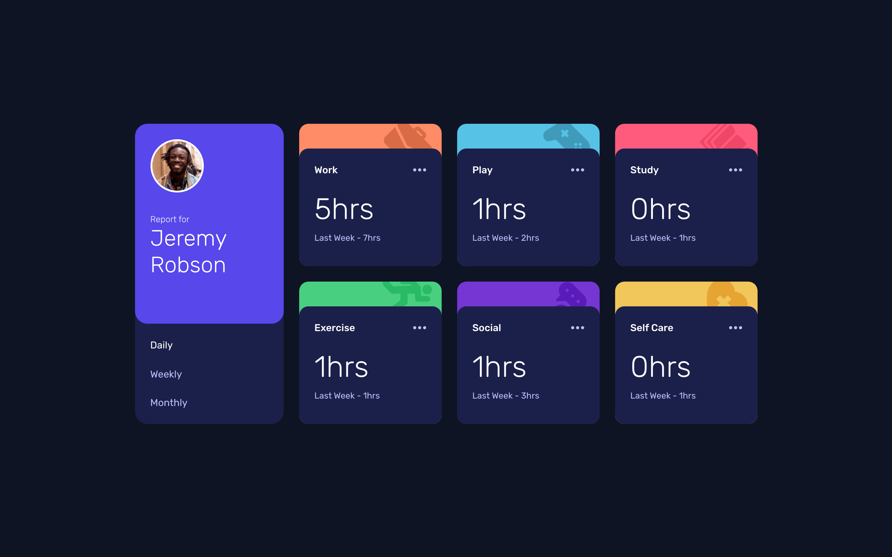
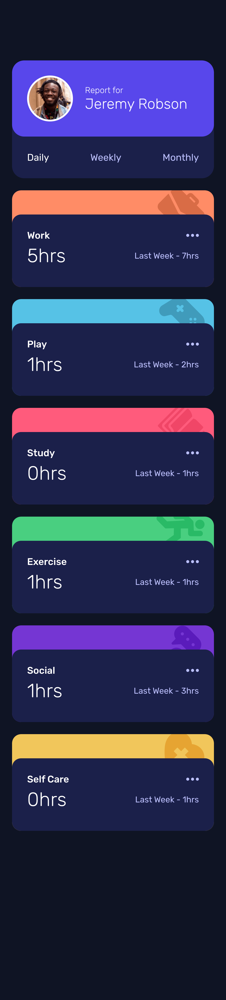

# Frontend Mentor - Time tracking dashboard solution

This is a solution to the [Time tracking dashboard challenge on Frontend Mentor](https://www.frontendmentor.io/challenges/time-tracking-dashboard-UIQ7167Jw). Frontend Mentor challenges help you improve your coding skills by building realistic projects.

## Table of contents

- [Frontend Mentor - Time tracking dashboard solution](#frontend-mentor---time-tracking-dashboard-solution)
  - [Table of contents](#table-of-contents)
  - [Overview](#overview)
    - [The challenge](#the-challenge)
    - [Screenshots](#screenshots)
      - [Desktop solution](#desktop-solution)
      - [Mobile solution](#mobile-solution)
    - [Links](#links)
    - [Built with](#built-with)
    - [Useful resources](#useful-resources)
  - [Author](#author)

## Overview

### The challenge

Users should be able to:

-   View the optimal layout for the site depending on their device's screen size
-   See hover states for all interactive elements on the page
-   Switch between viewing Daily, Weekly, and Monthly stats

### Screenshots

#### Desktop solution

#### Mobile solution

### Links

-   Solution URL: [GitHub](https://github.com/ab-cisco/frontend-mentor-time-tracking)
-   Live Site URL: [GitHub Pages](https://ab-cisco.github.io/frontend-mentor-time-tracking/)

### Built with

-   Semantic HTML5 markup
-   CSS custom properties
-   Flexbox
-   CSS Grid
-   Mobile-first workflow
-   [React](https://reactjs.org/) - JS library

### Useful resources

-   [create-react-app](https://create-react-app.dev/docs/getting-started) - This helped me for tuning project and use prepared config for webpack.
-   [doka guid](https://doka.guide/) - This is an amazing site helped me to improve css style skills.

## Author

-   Website - [Aleksandr Berezin](https://github.com/ab-cisco)
-   Frontend Mentor - [@ab-cisco](https://www.frontendmentor.io/profile/ab-cisco)
